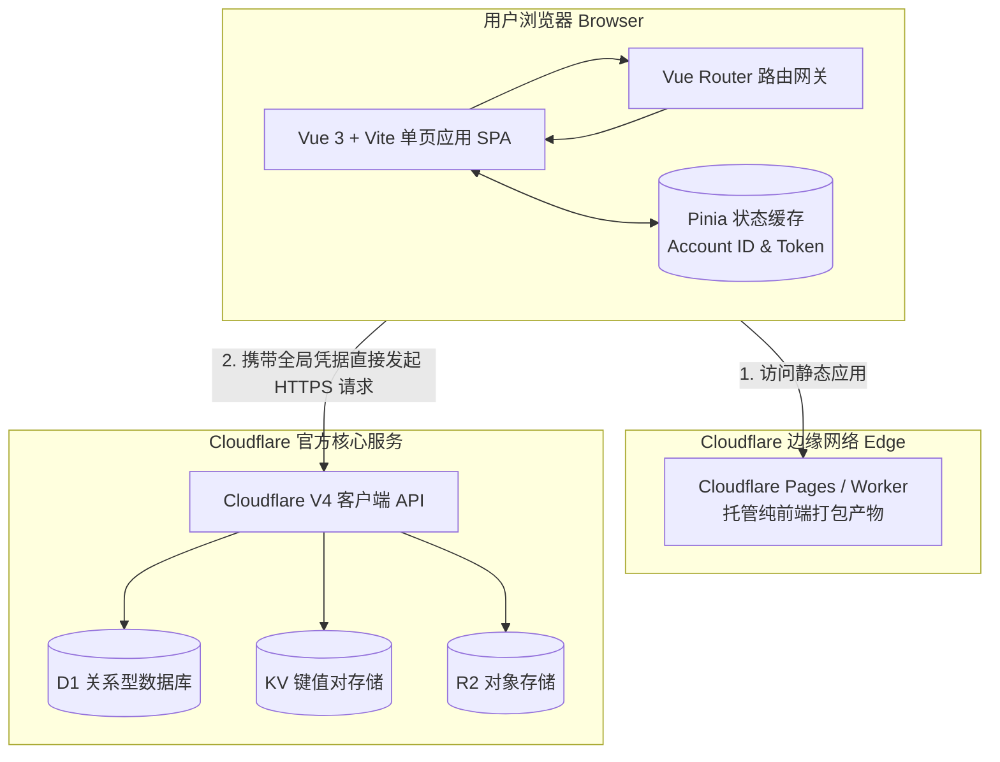
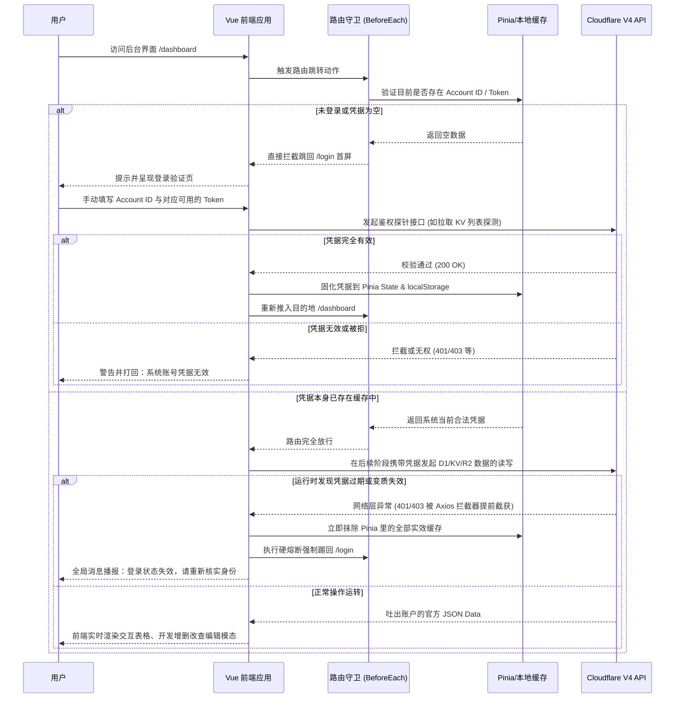

# Cloudflare 的 R2、D1、KV 可视化数据管理平台项目方案

## 一、 项目概述

本项目旨在开发一个基于 **Vue 3 + Vite** 的前端单页面应用（SPA）。打破传统开发理念，**完全不需要独立后端服务**，整个前端应用全量直接部署至 **Cloudflare Worker (或 Pages)** 上，并通过同源架构直连操作用户账号下 **D1（关系型数据库）**、**KV（键值存储）** 和 **R2（对象存储）** 的全量资源展示及**增、删、改、查 (CRUD)**。

## 二、 架构设计与技术栈选型

### 前端技术栈

- **核心框架**：Vue 3 (Composition API / `<script setup>`) + Vite
- **路由控制**：Vue Router 4
- **状态管理**：Pinia（用于全局存储 Cloudflare Account ID 及鉴权信息）
- **UI 组件库**：Element Plus 或 Naive UI（提供高品质的数据表格、抽屉和对话框，极致契合后台数据管理交互）
- **网络接口**：原生 Fetch 二次封装或 Axios（统一拦截器处理持续鉴权闭环）
- **样式引擎**：Tailwind CSS / UnoCSS

### 纯前端同构部署方案（极简无独立后端）

摒弃各类独立的后端代理服务，打造开箱即用的单体边缘架构：

- **直连与代理同构**：将 Vue 项目编译后直接发布托管至 **Cloudflare Worker**（或带 Functions 单一入口的 Cloudflare Pages）。
- **同域安全调用**：所有的 R2、D1、KV 原生接口调用皆通过部署在一起的同源环境进行直连拦截（或由前端应用层通过 Worker 机制进行 HTTP 请求发起验证）。因为代码部署在 Cloudflare 端上，这规避了直接的前端越权跨域问题，且彻底免去了外置后端服务器的使用限制。
- **免运维体验**：直接依托客户端与边缘侧通信机制对接，降低运维成本。

### 架构图 (系统边界与应用流向)

## 三、 功能架构与模块设计

### 1. 认证与全局持续鉴权 (Auth & Validation) 流程图

- **强制拦截机制**：系统默认为全封闭状态。若未验证账户，一律拦截并跳转至**首页/登录页**。
- **全链路持续验活机制**：路由守卫 (Router Guard) 与底层网络级 Axios 实时拦截相结合。

#### 鉴权与流转时序图

### 2. 概览主页 (Dashboard)

- **卡片式数据展示**：在路由切换进入仪表盘后，直接基于全局已校准的 Account ID 触发数据并发拉取流。展示以下三个层级的资源目录方块：
  - **R2 Block**：当前所有的对象存储桶 (Buckets)。
  - **D1 Block**：当前所有的 SQL Serverless 关系数据库 (Databases)。
  - **KV Block**：分布式的键值命名空间集 (Namespaces)。
- **操作跳转流**：点击某张资源卡片，将其全局对应 ID 带入 URL Path，并跳转进入详细数据的 **List 业务展示页**。

### 3. KV 资源管理具体模块

- **展示结构**：进入后展示表格化的核心两列：`Key (键)` 以及内容 `预览截断展示 (Value preview)`。
- **数据级 CRUD 支持**：
  - **增加 (Create)**：右侧划出编辑抽屉，内置 JSON / String 双模表单填写键值对插入远端。
  - **修改 (Update)**：点击列项目，附带现有数据反填进行 Value 热更新。
  - **删除 (Delete)**：单行销毁操作，辅以二次提醒遮罩。

### 4. D1 数据库管理模块

- **全局库分析**：加载相关 D1 库的 ID 后，界面左侧栏自动拉取执行内置探针以获得所有由本账号下创建的业务数据表 Table。
- **智能数据流展示**：点击任意 Table 进行数据 `SELECT` 探测并根据返回的数据字典动态建立动态表头及分页列层。内置行属性编辑态激活支持。
- **原生 SQL 终端面板**：留白提供自定义代码输入终端（执行原生的 `INSERT / UPDATE` 及重构 DDL 级建库改列能力）。

### 5. R2 存储桶管理模块

- **仿系统驱动器层级化**：利用查询过滤对象返回结构中的 `/` 拆解重构树状 JSON 以模拟类似 Windows 资源管理器的层级目录进入逻辑及顶部面包屑导航。
- **操作矩阵**：支持对文件的读列表查询、使用拖放 API 快速上传本地资源并在后台直写 Bucket、图片直视公网链接转换浏览方案以及对单选/多选陈旧对象的批量垃圾箱清理能力。

---

## 四、 极简单体化开发排期 (TODOs)

### Phase 1: 纯前端基建与 Cloudflare 生态适配

- [ ] 初始化 `cloudflare-admin-ui` 的 Vite Vue3 TypeScript 模板脚手架。
- [ ] 根据 UI 规划集成 Vue Router 4, Pinia 以及 Element Plus / Naive UI。
- [ ] 配置适配 Wrangler 工具链的环境逻辑和本地 `wrangler dev` 开发级支持验证。

### Phase 2: 开发全局守恒的鉴权路由网关

- [ ] 设计以 Account ID 驱动认证的交互落地页 `Login.vue` 及对应交互状态展示。
- [ ] 设立存储全局敏感凭据和身份校验逻辑的 `useAuthStore` 模块。
- [ ] 关键开发项：建立完备的拦截机制，实现 `axios`的非 20x 异常态监控与 Vue Router 的非法入侵识别，保证验证失效后无视所在层级“一键打回首页重新提示登录”。

### Phase 3: Dashboard 视图概览设计与对接

- [ ] 实现针对根资源大盘的并线请求及装载骨架屏(Skeleton)。
- [ ] 完成针对三大主域对象拉取的纯前端异步获取流的二次处理装配渲染入卡片模块。

### Phase 4 - Phase 6: D1 / KV / R2 内页矩阵深度攻坚

- [ ] （KV 阶段）渲染动态搜索列及支持 Monaco 编辑能力嵌入的维护模态框组件。
- [ ] （D1 阶段）表头字段动态分析并动态绑定 Vue Table Column 建立能力和专属 Sql Runner 视图界面搭建。
- [ ] （R2 阶段）完成逻辑算法级的文件穿梭树重建、上传控制层对接流上传及前端批量操作行为落地。

### Phase 7: 项目细节收尾与云端编译发布

- [ ] 全域场景回归测试请求异常与超时拦截跳转首页的表现一致性。
- [ ] 打包产物构建，结合预先配置好的发布脚本 `wrangler pages deploy`（或直接 Workers 资源包裹上线）一键直飞 Cloudflare 原生服务端检验生产环境。
