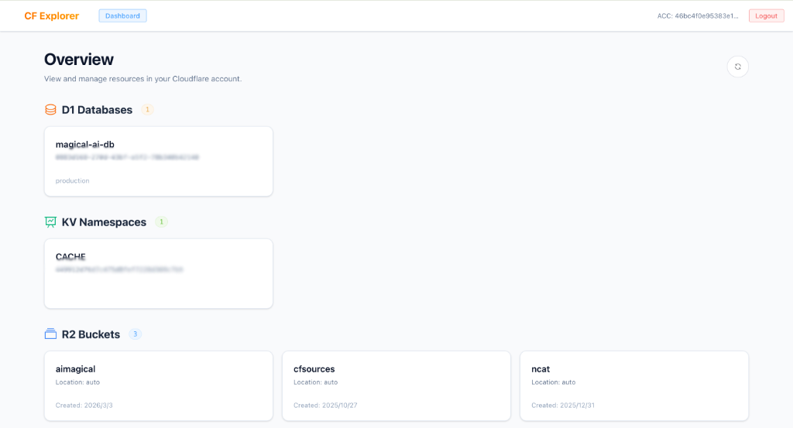
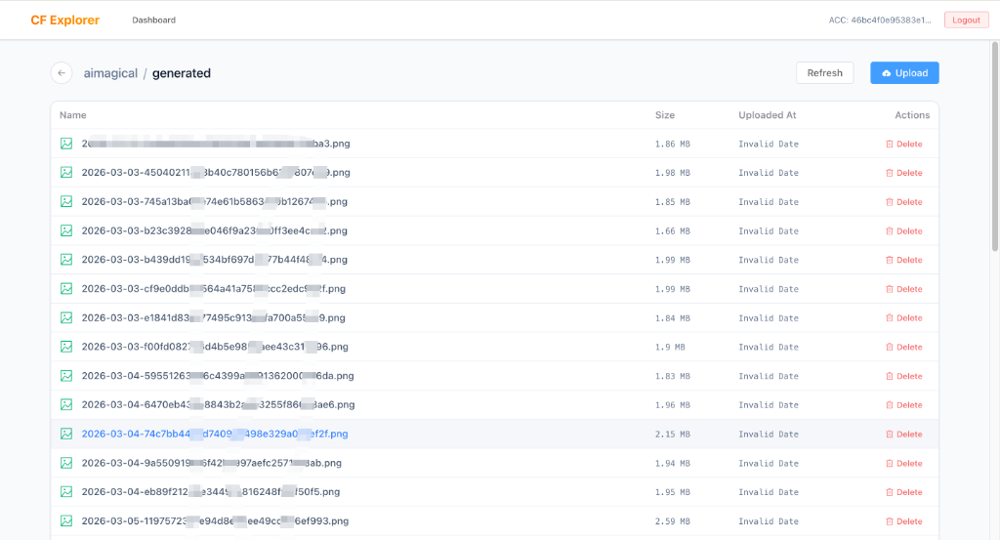
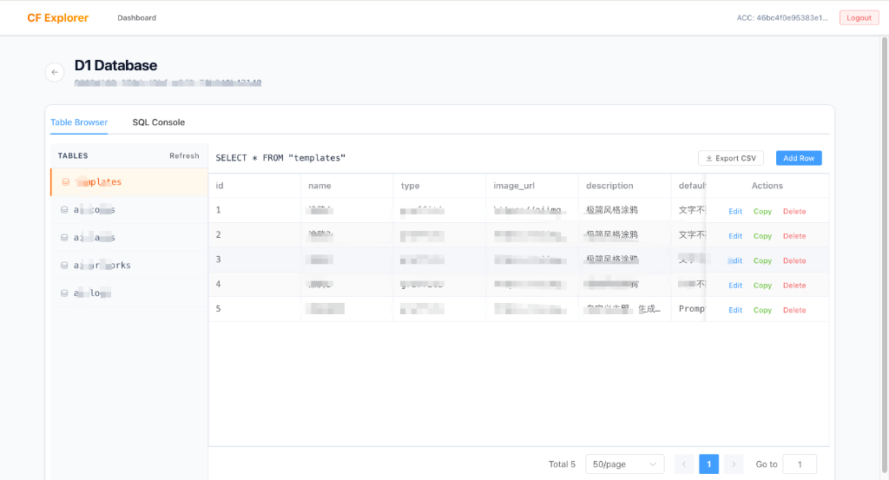
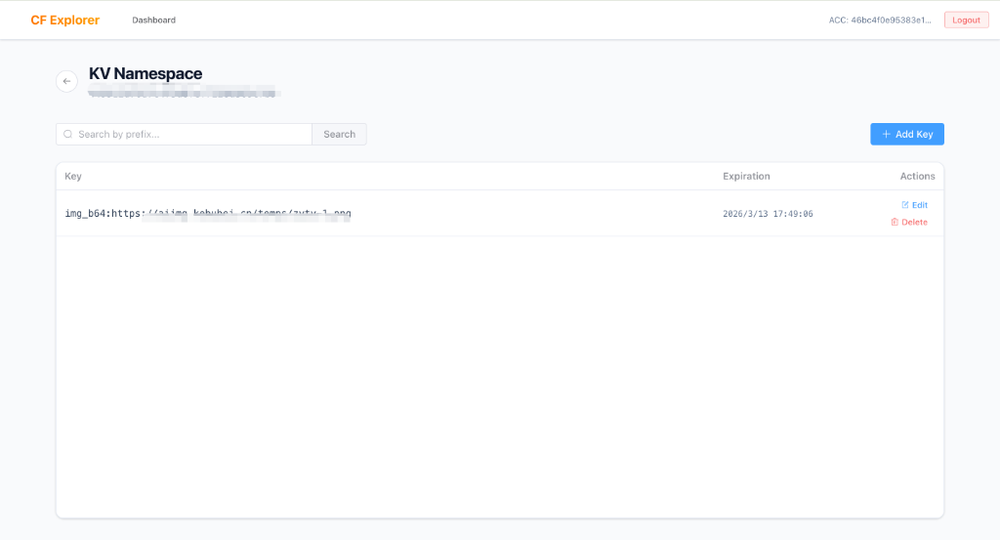

# CF Data Explorer


[English](./README_EN.md) | 简体中文

一个纯前端架构的现代化 Cloudflare 数据管理面板，可在不登录官方控制台的情况下，通过 API Key 安全直连并管理您名下的 Cloudflare 资产。

## 核心功能



- **📦 R2 对象存储管理**
  - 支持真正的子目录结构浏览。
  - 完美处理超大目录下的自动长尾分页游览，告别加载卡顿。
  - 支持极速的文件上传与批量删除。

  

- **📊 D1 数据库管理**
  - 可见即所得的库表结构解析与实时浏览。
  - 支持基于表格模式的增删改查（提供类似底层 SQL 级别的单行精细化全量 `Copy` 能力以辅助快速录入数据）。
  - 内置基于 `LIMIT/OFFSET` 的表格动态分页检索。
  - 内置 SQL 编辑控制台，支持随意执行自由 `Query`。
  - 一键将表内检索结果导出为 `.csv` 文件。

  

- **🔑 KV 键值对管理**
  - 支持直观全量的键值对读写与增删。

  

---

## 🚀 部署指南

本项目采用 Vue 3 + Vite 构建。为了越过浏览器的跨域(CORS)限制与 API 安全鉴权探测，本项目在发起真实 `https://api.cloudflare.com` 请求时，**需要一个任意形态的服务端代为转发请求**。

根据您的基础设施环境，请选择以下一种方式进行部署：

### 部署方案 1：部署到 Cloudflare 网络（推荐）

进入 Cloudflare 官网，按照截图步骤来：

1. 在左侧菜单栏面板找到并点击 **Workers 和 Pages**。
2. 点击页面右侧的 **创建应用程序** 按钮。
3. 在 “Ship something new” 区域，直接选择 **Continue with GitHub** 或者您的其它代码仓库平台，一键全自动拉取并部署本项目。
4. 部署成功后，将您编译好的项目文件以及 proxy 代理逻辑交给该应用接管，即可享受官方全球网络加速。

### 部署方案 2：使用您自己的 Linux 服务器 (基于 Nginx)

如果您规范要求将前端项目运行在私有云（例如配置好的 CentOS、宝塔面板），请利用 Nginx 的原生底座拦截 `/client/v4/` 发出反代：

1. 编译纯静态前端资产：
   ```bash
   yarn build
   ```
2. 将得到的 `/dist` 文件夹上传到服务器（如：`/www/cf-explorer/dist`）。
3. 配置该域名的 Nginx Server：

   ```nginx
   server {
       listen 80;
       server_name your-ip-or-domain.com;

       # 指向页面静态资源
       root /www/cf-explorer/dist;
       index index.html;

       # 防止 Vue 刷新引发 404
       location / {
           try_files $uri $uri/ /index.html;
       }

       # 核心：跨域 API 代理
       location /client/v4/ {
           # 处理 OPTIONS 探路预检请求
           if ($request_method = 'OPTIONS') {
               add_header 'Access-Control-Allow-Origin' '*';
               add_header 'Access-Control-Allow-Methods' 'GET, POST, PUT, DELETE, OPTIONS, PATCH';
               add_header 'Access-Control-Allow-Headers' 'Content-Type, X-Auth-Email, X-Auth-Key';
               return 204;
           }

           # 反代真实流量
           proxy_pass https://api.cloudflare.com/client/v4/;
           proxy_set_header Host api.cloudflare.com;
           proxy_ssl_server_name on;

           # 强行返回 CORS Headers
           add_header 'Access-Control-Allow-Origin' '*';
           add_header 'Access-Control-Allow-Methods' 'GET, POST, PUT, DELETE, OPTIONS, PATCH';
       }
   }
   ```

4. 执行 `nginx -s reload`。

### 部署方案 3：使用轻量级 Node.js 服务部署

如果您的服务器无法安装 Nginx 但有 Node.js 包环境，则只需两步：

1. 创建一个轻便的 `server.js` 启动网关服务：

   ```js
   const express = require("express");
   const { createProxyMiddleware } = require("http-proxy-middleware");
   const path = require("path");
   const cors = require("cors");

   const app = express();
   app.use(
     cors({
       origin: "*",
       methods: ["GET", "POST", "PUT", "DELETE", "OPTIONS", "PATCH"],
       allowedHeaders: ["Content-Type", "X-Auth-Email", "X-Auth-Key"],
     }),
   );

   app.use(
     "/client/v4",
     createProxyMiddleware({
       target: "https://api.cloudflare.com",
       changeOrigin: true, // 开启 SNI
     }),
   );

   app.use(express.static(path.join(__dirname, "dist")));
   app.get("*", (req, res) =>
     res.sendFile(path.join(__dirname, "dist/index.html")),
   );

   app.listen(3000, () => console.log("Server is running on port 3000"));
   ```

2. 使用 `pm2 start server.js` 将其持久化后台运行。
